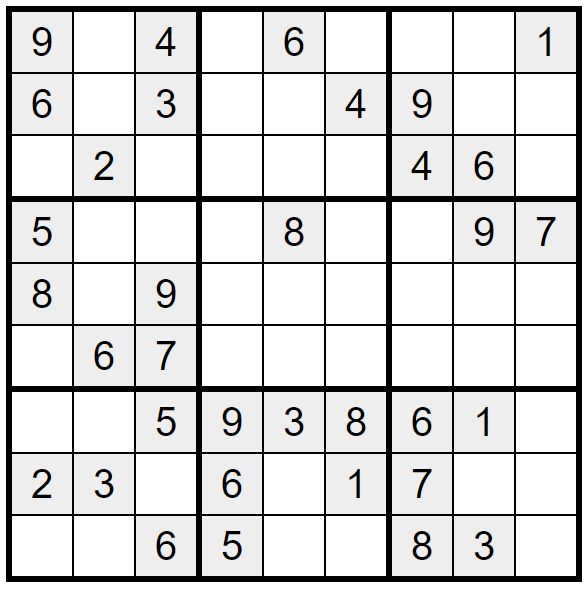
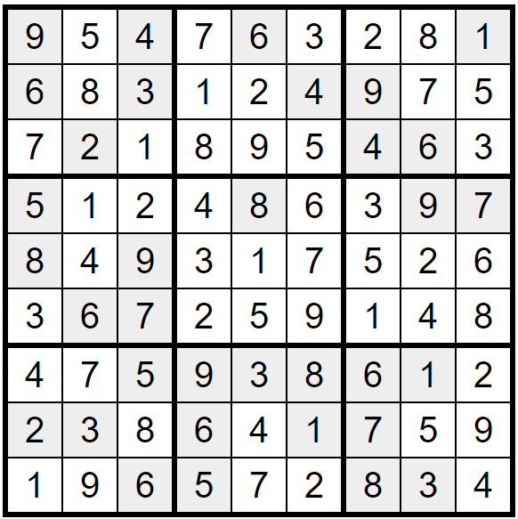

# Sudoku-Solver
Sudoku Solver is an algorithm that will generate and solve a sudoku puzzle.

## How to run
To run from the terminal, open the main Sudoku-Solver directory. Then run `python main.py`. After that, type in your empty sudoku board as a string of numbers. Here is an example:



To convert this into an input for the Sudoku board, you would type:
`"904060001603004900020000460500080097809000000067000000005938610230601700006500830"`

This will output the solved sudoku board:

```text
9 5 4 | 3 6 7 | 2 8 1 
6 8 3 | 1 2 4 | 9 7 5 
7 2 1 | 8 5 9 | 4 6 3 
------+-------+------
5 1 2 | 4 8 6 | 3 9 7 
8 4 9 | 7 1 3 | 5 2 6 
3 6 7 | 2 9 5 | 1 4 8 
------+-------+------
4 7 5 | 9 3 8 | 6 1 2 
2 3 8 | 6 4 1 | 7 5 9 
1 9 6 | 5 7 2 | 8 3 4 
```

